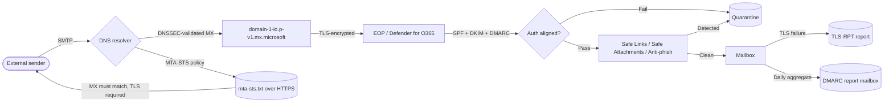

# NextLayerSec Email Security Framework

> A production-validated email security hardening framework for M365 environments.
> Built and deployed across multiple domains. Designed as a repeatable MSP delivery framework.

[](https://nextlayersec.io)
[](https://mta-sts.nextlayersec.io/.well-known/mta-sts.txt)
[](https://dnssec-analyzer.verisignlabs.com/nextlayersec.io)
[](https://creativecommons.org/licenses/by-nd/4.0/)

---

## Overview

Most organizations deploy DMARC and call their email security done.

**DMARC does not protect SMTP transit.**

This framework documents the complete email security stack -- from sender authentication
through transport-layer enforcement -- deployed in production across multiple domains under
a single Microsoft 365 Business Premium tenant.

Every control documented here has been implemented, validated, and verified against live DNS
and M365 tenant configuration. Screenshots of all validation outputs are available in the
[`/validation`](/validation) directory.

---

## Quickstart

The fastest path to a hardened domain. Each step links to the full
walkthrough -- the snippet here is the 10-minute version.

1. **Publish SPF, DMARC monitor, MX** -- see [`dns/dns-setup.md`](dns/dns-setup.md)
   ```
   @       TXT    "v=spf1 include:spf.protection.outlook.com -all"
   _dmarc  TXT    "v=DMARC1; p=none; rua=mailto:dmarc@<domain>"
   @       MX     <domain-hyphens>.mail.protection.outlook.com  pri 0
   ```
2. **Enable DKIM** in Defender, publish the two CNAMEs -- see [`dkim/selector-management.md`](dkim/selector-management.md)
3. **Watch DMARC reports** for 2-4 weeks, then tighten to `p=reject` -- see [`dmarc/monitoring-setup.md`](dmarc/monitoring-setup.md)
4. **Deploy MTA-STS** on GitHub Pages -- see [`mta-sts/deployment-guide.md`](mta-sts/deployment-guide.md)
5. **Enable DNSSEC** at the DNS provider and in Exchange Online; swap MX to `p-v1.mx.microsoft` -- see [`dns/dnssec-deployment.md`](dns/dnssec-deployment.md)
6. **Run the Exchange Online hardening baseline** -- see [`exchange-online/hardening-runbook.md`](exchange-online/hardening-runbook.md)
7. **Deploy Conditional Access** policies for MFA + legacy-auth block -- see [`conditional-access/policies.md`](conditional-access/policies.md)

For alias domains under an already-hardened tenant the abbreviated playbook
is in [`domains/alias-quickstart.md`](domains/alias-quickstart.md).

---

## Mail Flow



---

## The Stack

| Layer | Control | Purpose |
|---|---|---|
| Sender Authentication | SPF | Authorizes sending sources for the domain |
| Message Integrity | DKIM | Cryptographic signature on every outbound message |
| Policy Enforcement | DMARC | Enforces SPF/DKIM alignment, enables aggregate reporting |
| Forwarder Trust | ARC | Preserves auth results across mailing lists / forwarders |
| Transport Security | MTA-STS | Forces TLS on inbound SMTP, prevents downgrade attacks |
| DNS Integrity | DNSSEC | Cryptographically signs DNS records, prevents cache poisoning |
| Receive Hardening | DNSSEC-aware MX | M365 DNSSEC-validated inbound endpoint |
| Cert Issuance Control | CAA | Restricts which CAs can issue certs for the domain |
| Brand Display | BIMI | Publishes brand logo alongside authenticated mail |
| Failure Visibility | TLS-RPT | Reports TLS failures on inbound mail delivery |
| Identity & Access | Conditional Access | Gates sign-ins by MFA, device compliance, risk, location |
| Content Inspection | Defender for O365 | Safe Links, Safe Attachments, anti-phish, ZAP |

### Why each matters

Each control closes a gap the others cannot:

- **SPF alone** -- doesn't prevent header spoofing, no cryptographic proof
- **DKIM alone** -- doesn't prevent replay attacks without DMARC alignment
- **DMARC alone** -- doesn't protect SMTP transit after DNS resolution
- **MTA-STS alone** -- cached policy can be stale, doesn't protect the DNS layer
- **DNSSEC alone** -- doesn't enforce TLS on delivery, doesn't authenticate sender
- **CAA alone** -- prevents fraudulent certs but not DNS tampering (pair with DNSSEC)
- **CA + MFA alone** -- protects sign-in but not the content of delivered mail

The full stack is required end-to-end.

---

## Domain Coverage

| Domain | SPF | DKIM | DMARC | MTA-STS | DNSSEC | DNSSEC-aware MX | TLS-RPT |
|---|:---:|:---:|:---:|:---:|:---:|:---:|:---:|
| `domain-1.io` | PASS | PASS | `p=reject` | `enforce` | Enabled | Enabled | Configured |
| `domain-2.dev` | PASS | Pending | Deployed | Pending | Pending | Pending | Pending |
| `domain-3.com` | iCloud | iCloud | Pending | Pending | Pending | Pending | Pending |

> All three domains are active aliases under a single M365 Business Premium tenant.
> The primary domain is fully hardened and independently validated.
> Secondary and personal-brand domains are in progress -- see `/domains/` for per-domain status.
> Real domain names and tenant identifiers are intentionally not committed to this repository -- see [SECURITY.md](SECURITY.md).

---

## Documentation Map

| Topic | File |
|---|---|
| **Get started** | [`dns/dns-setup.md`](dns/dns-setup.md) -- provider-agnostic walkthrough |
| **Cloudflare specifics** | [`dns/cloudflare-records.md`](dns/cloudflare-records.md) |
| **DKIM** | [`dkim/selector-management.md`](dkim/selector-management.md) -> [`key-rotation.md`](dkim/key-rotation.md) -> [`validation.md`](dkim/validation.md) |
| **DMARC** | [`dmarc/monitoring-setup.md`](dmarc/monitoring-setup.md) -> [`report-analysis.md`](dmarc/report-analysis.md) -> [`arc.md`](dmarc/arc.md) |
| **MTA-STS** | [`mta-sts/deployment-guide.md`](mta-sts/deployment-guide.md) + per-domain configs |
| **DNSSEC** | [`dns/dnssec-deployment.md`](dns/dnssec-deployment.md) |
| **CAA** | [`dns/caa-records.md`](dns/caa-records.md) |
| **BIMI** | [`bimi/deployment.md`](bimi/deployment.md) |
| **Exchange Online hardening** | [`exchange-online/hardening-runbook.md`](exchange-online/hardening-runbook.md) + [`baseline-checklist.md`](exchange-online/baseline-checklist.md) |
| **Conditional Access** | [`conditional-access/policies.md`](conditional-access/policies.md) |
| **Defender for O365 tuning** | [`defender/tuning.md`](defender/tuning.md) |
| **Tenant Allow/Block List** | [`defender/tenant-allow-block.md`](defender/tenant-allow-block.md) |
| **User phish reporting** | [`defender/user-reporting.md`](defender/user-reporting.md) |
| **Incident response** | [`incident-response/runbook.md`](incident-response/runbook.md) |
| **Per-domain status** | [`domains/`](domains/) (one file per domain) |
| **Alias domain quickstart** | [`domains/alias-quickstart.md`](domains/alias-quickstart.md) |
| **Glossary** | [`GLOSSARY.md`](GLOSSARY.md) |
| **Contributing** | [`CONTRIBUTING.md`](CONTRIBUTING.md) |
| **Security policy** | [`SECURITY.md`](SECURITY.md) |
| **Change log** | [`changelog.md`](changelog.md) |

---

## Repository Structure

```
nextlayersec-email-security/
|
|-- bimi/
|   `-- deployment.md               # BIMI logo + DNS deployment
|
|-- conditional-access/
|   `-- policies.md                 # Entra ID CA policy baseline
|
|-- defender/
|   |-- tuning.md                   # Safe Links / Safe Attachments / anti-phish tuning
|   |-- tenant-allow-block.md       # Manual IOC / exception list
|   `-- user-reporting.md           # End-user phish reporting workflow
|
|-- dkim/
|   |-- selector-management.md      # Selector configuration and DNS records
|   |-- key-rotation.md             # Key rotation procedure and log
|   `-- validation.md               # Validation procedures and current status
|
|-- dmarc/
|   |-- monitoring-setup.md         # DMARC aggregate reporting setup
|   |-- report-analysis.md          # Reading and acting on aggregate reports
|   `-- arc.md                      # ARC (Authenticated Received Chain) overview
|
|-- dns/
|   |-- dns-setup.md                # Provider-agnostic DNS setup guide
|   |-- cloudflare-records.md       # Cloudflare-specific record reference
|   |-- dnssec-deployment.md        # DNSSEC enablement via M365 PowerShell
|   |-- caa-records.md              # CAA record deployment
|   `-- record-templates.md         # Copy-paste DNS record templates
|
|-- domains/
|   |-- _template.md                # Reusable onboarding template
|   |-- alias-quickstart.md         # 30-min alias domain playbook
|   |-- domain-1.md                 # Primary domain security record
|   |-- domain-2.md                 # Secondary domain security record
|   `-- domain-3.md                 # Personal-brand domain security record
|
|-- exchange-online/
|   |-- hardening-runbook.md        # Full PowerShell hardening session
|   `-- baseline-checklist.md       # Verification checklist
|
|-- incident-response/
|   `-- runbook.md                  # IR playbooks for the common email incidents
|
|-- mta-sts/
|   |-- domain-1.md                 # MTA-STS deployment - primary domain
|   |-- domain-2.md                 # MTA-STS deployment - secondary domain
|   `-- deployment-guide.md         # Repeatable deployment framework
|
|-- validation/
|   |-- mxtoolbox-mta-sts.png       # MXToolbox MTA-STS validation
|   |-- verisign-dnssec.png         # Verisign DNSSEC chain validation
|   `-- powershell-dnssec.png       # Exchange Online PowerShell output
|
|-- .github/workflows/docs.yml      # CI: markdownlint, link check, secret scan, OSINT check
|-- .markdownlint-cli2.yaml
|-- .lycheeignore
|-- CONTRIBUTING.md
|-- GLOSSARY.md
|-- LICENSE
|-- README.md
|-- SECURITY.md
`-- changelog.md
```

---

## MTA-STS Deployment

MTA-STS (RFC 8461) allows domain owners to publish a policy requiring sending MTAs to
validate TLS certificates before delivering mail. Policy enforcement prevents SMTP downgrade
attacks where an attacker strips TLS from the delivery path.

### How it works

```
Sending MTA                DNS                    Policy Host             Receiving MTA
     |                      |                          |                       |
     |-- MX lookup -------->|                          |                       |
     |<- MX record ---------|                          |                       |
     |                      |                          |                       |
     |-- _mta-sts TXT ----->|                          |                       |
     |<- "v=STSv1; id=X" ---|                          |                       |
     |                      |                          |                       |
     |-- HTTPS policy fetch --------------------------->|                       |
     |<- mta-sts.txt ----------------------------------|                       |
     |                      |                          |                       |
     |-- Validate MX matches policy                                            |
     |-- Validate TLS cert on MX host                                          |
     |-- Deliver over verified TLS ------------------------------------------>|
```

### Policy file structure

```
version: STSv1
mode: enforce
mx: domain-1-io.p-v1.mx.microsoft
max_age: 604800
```

| Field | Value | Notes |
|---|---|---|
| `version` | `STSv1` | Only supported version |
| `mode` | `enforce` | Reject delivery if TLS validation fails |
| `mx` | MX hostname | Must exactly match live MX record |
| `max_age` | `604800` | Policy cache TTL in seconds (7 days) |

### Hosting on GitHub Pages

MTA-STS policy files must be served over HTTPS at:
`https://mta-sts.<domain>/.well-known/mta-sts.txt`

GitHub Pages provides free HTTPS hosting. Two configuration requirements:

**1. Disable Jekyll processing**

Jekyll silently blocks dotfolders including `.well-known/`.
Add an empty `.nojekyll` file to the repo root to serve static files as-is.

**2. Disable Cloudflare proxy on the CNAME**

GitHub Pages handles TLS termination for custom domains.
Cloudflare proxying (orange cloud) breaks certificate provisioning.
The `mta-sts` CNAME must be DNS-only (grey cloud).

### Required DNS records

```
# Policy host
mta-sts.<domain>    CNAME    <user>.github.io      (DNS-only)

# Policy signal
_mta-sts.<domain>   TXT      "v=STSv1; id=YYYYMMDD"

# TLS failure reporting
_smtp._tls.<domain> TXT      "v=TLSRPTv1; rua=mailto:tlsrpt@<domain>"
```

> Update the `id` value in `_mta-sts` whenever the policy file changes.
> Receiving MTAs cache the policy -- a changed `id` signals them to re-fetch.

---

## DNSSEC + DNSSEC-Aware MX Endpoint

### What DNSSEC protects against

Without DNSSEC, an attacker who poisons a DNS resolver cache can redirect MX lookups
to a server they control -- intercepting inbound business email silently with no delivery
failure visible on either end.

DNSSEC cryptographically signs DNS records. Resolvers validate signatures against the
chain of trust from root -> TLD -> domain. A forged or tampered record fails validation
and is rejected before reaching the sending MTA.

### DNSSEC-aware MX endpoint

When DNSSEC is enabled in Exchange Online, the MX endpoint changes from:

```
# Standard endpoint
domain-com.mail.protection.outlook.com

# DNSSEC-aware endpoint
domain-com.p-v1.mx.microsoft
```

The `p-v1.mx.microsoft` endpoint only accepts connections from resolvers that validated
DNSSEC -- adding verification on the receiving side in addition to the sending side.

### Enabling via Exchange Online PowerShell

```powershell
# Connect
Connect-ExchangeOnline -UserPrincipalName admin@yourdomain.com

# Enable - note the new MX value in output
Enable-DnssecForVerifiedDomain -DomainName yourdomain.com

# Verify
Get-DnssecStatusForVerifiedDomain -DomainName yourdomain.com | Format-List *
```

> After enabling, update the MX record in DNS and the `mx:` value in `mta-sts.txt`
> to match the new `p-v1.mx.microsoft` endpoint before mail flow is affected.

### Validation

```powershell
# Check DNSSEC signing chain
# https://dnssec-analyzer.verisignlabs.com/<domain>

# Check M365 tenant recognition
Get-DnssecStatusForVerifiedDomain -DomainName yourdomain.com | Format-List *

# Check DNS record
nslookup -type=DS yourdomain.com
```

---

## CAA -- Certificate Authority Authorization

DNSSEC prevents DNS tampering. CAA prevents fraudulent certificate issuance.
Together they close two separate attack paths against your domain identity:
without CAA, any public CA can issue a cert for your domain, so a single
rogue or compromised CA is enough to break TLS even if your DNS is sound.

CAA records (RFC 8659) list the CAs you authorize to issue certs. All major
public CAs are required to honor CAA at issuance time.

### Recommended baseline

```
@    CAA    0 issue "letsencrypt.org"
@    CAA    0 issue "pki.goog"
@    CAA    0 issue "digicert.com"
@    CAA    0 issuewild "letsencrypt.org"
@    CAA    0 issuewild "pki.goog"
@    CAA    0 issuewild "digicert.com"
@    CAA    0 iodef "mailto:admin@<domain>"
```

| Tag | Purpose |
|---|---|
| `issue` | Authorizes a CA to issue regular certs |
| `issuewild` | Authorizes a CA to issue wildcard certs (separate from `issue`) |
| `iodef` | Email address that receives reports of failed issuance attempts |

Trim the list to only CAs you actually use. The smaller the authorization
set, the smaller the attack surface.

### Validation

```bash
dig +short CAA <domain>
```

External validators:
- <https://caatest.co.uk/>
- <https://sslmate.com/caa/>
- MXToolbox CAA Lookup

### Why this matters alongside DNSSEC

DNSSEC stops an attacker from forging your DNS records.
CAA stops an attacker who obtained a fraudulent cert from passing TLS validation.
Deploy together -- CAA without DNSSEC can itself be stripped by a DNS attacker.

Full reference: [`dns/caa-records.md`](dns/caa-records.md).

---

## Alias Domain Hardening

Alias domains that share mail flow with a primary domain are still active spoofing
surfaces if left unprotected. A domain with no SPF or DMARC record can be used to
send email that appears to originate from your organization regardless of whether
it has an active MX record.

### Required records for alias domains

```
# SPF - authorize the same sending infrastructure as primary
v=spf1 include:spf.protection.outlook.com -all

# DKIM - configure signing in Exchange Online for each domain
# DMARC - full enforcement, no monitoring phase needed for aliases
v=DMARC1; p=reject; rua=mailto:dmarc@<domain>

# MTA-STS - enforce TLS on inbound delivery
# DNSSEC - sign all DNS records via registrar or Cloudflare
```

> Each alias domain should be independently validated even if mail flow
> is handled by the primary domain tenant configuration.

---

## Exchange Online Hardening

The full PowerShell hardening runbook is in [`/exchange-online/hardening-runbook.md`](/exchange-online/hardening-runbook.md).

### Controls covered

| Control | Command | Impact |
|---|---|---|
| Legacy auth lockdown | `Set-AuthenticationPolicy` | Blocks basic auth on all protocols |
| SMTP client auth | `Set-TransportConfig` | Disables legacy SMTP relay tenant-wide |
| External auto-forward | `Set-RemoteDomain` | Prevents exfiltration via mail forwarding rules |
| Protocol hardening | `Set-CasMailbox` | Disables POP and IMAP at mailbox level |
| ActiveSync scoping | Conditional Access | Scoped to compliant Intune-managed devices |
| Mailbox auditing | `Set-Mailbox` | 180-day audit log retention, all actions logged |
| Outbound spam notify | `Set-HostedOutboundSpamFilterPolicy` | Alert on compromised account sending spam |
| DNSSEC enablement | `Enable-DnssecForVerifiedDomain` | Switches to DNSSEC-aware MX endpoint |

---

## Validation Tools

| Tool | Purpose | URL |
|---|---|---|
| MXToolbox MTA-STS | Full MTA-STS policy validation | mxtoolbox.com/SuperTool |
| Verisign DNSSEC Analyzer | Full DNSSEC chain validation | dnssec-analyzer.verisignlabs.com |
| DMARCian | DMARC aggregate report analysis | dmarcian.com |
| curl | Direct policy file verification | `curl https://mta-sts.<domain>/.well-known/mta-sts.txt` |
| nslookup | DNS record verification | `nslookup -type=TXT _mta-sts.<domain>` |
| Exchange Online PS | Tenant-side DNSSEC validation | `Get-DnssecStatusForVerifiedDomain` |

---

## Related Tools — Coming Soon

- **Invoke-M365SecurityBaseline** -- PowerShell script that runs a full security baseline check against any M365 tenant with color-coded pass/fail output
- **Invoke-EmailSecurityAssessment** -- Domain assessment script that checks the full email security stack via public DNS lookups with no tenant access required

---

## References

| RFC | Title |
|---|---|
| RFC 8461 | SMTP MTA Strict Transport Security (MTA-STS) |
| RFC 8460 | SMTP TLS Reporting (TLS-RPT) |
| RFC 7208 | Sender Policy Framework (SPF) |
| RFC 6376 | DomainKeys Identified Mail (DKIM) |
| RFC 7489 | Domain-based Message Authentication, Reporting, and Conformance (DMARC) |
| RFC 4033 | DNS Security Introduction and Requirements (DNSSEC) |

---

## License

CC BY-ND 4.0 -- See [LICENSE](LICENSE) for details.

---

<div align="center">

**[NextLayerSec](https://nextlayersec.io)** &nbsp;|&nbsp;
**[LinkedIn](https://linkedin.com/company/nextlayersec)** &nbsp;|&nbsp;
**[GitHub](https://github.com/Blackvectra)**

*Cybersecurity consulting for organizations that take security seriously.*

</div>
